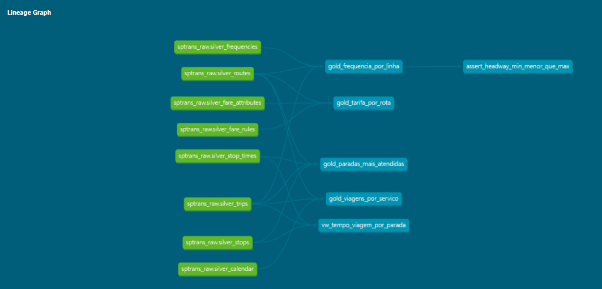

[](https://github.com/robertoBorgesJr/SPTrans/actions/workflows/dbt_ci.yml)

# 🚌 SPTrans GTFS Data Pipeline (Databricks + dbt)

Este projeto implementa um pipeline de dados moderno para processar e analisar dados de transporte público (GTFS) da SPTrans. O objetivo é transformar dados brutos em insights operacionais sobre a frequência de linhas e a densidade de paradas na cidade de São Paulo.

## 🛠️ Stack Tecnológica

- **Cloud:** Databricks 
- **Linguagens:** SQL, Python (PySpark)
- **Transformação:** dbt-core (v1.11.6)
- **Gerenciamento de Pacotes:** `uv` (Fast Python package installer)
- **Armazenamento:** Delta Lake (Medallion Architecture)

## 🏗️ Arquitetura de Dados (Medallion)

O projeto segue a arquitetura de medalhão para garantir qualidade e linhagem:

1.  **Bronze:** Dados brutos do GTFS carregados no Databricks.
2.  **Silver (Spark):** Limpeza, padronização de horários e deduplicação via PySpark (Notebook).
3.  **Gold (dbt):** Modelagem de negócios e agregações analíticas (Marts e Views).

## 📊 Modelos Gold Principais

- **Frequência por Linha:** Cálculo de headway (intervalo médio) segmentado por período do dia.
- **Paradas mais Atendidas:** Ranking de hubs de transporte com base no volume de viagens e diversidade de linhas.

## 🚦 Qualidade e Testes

Utilizamos o framework de testes do **dbt** para garantir a integridade do pipeline:
- **Testes Genéricos:** `not_null`, `unique`, `accepted_values`.
- **Testes de Negócio:** Validação de intervalos de tempo (headway positivo) e consistência lógica entre paradas.

## 🚀 Como Executar

### Pré-requisitos
- Python 3.10+ e `uv` instalado.
- Acesso a um SQL Warehouse no Databricks.

### Instalação
1. Clone o repositório:
   ```bash
   git clone [https://github.com/seu-usuario/sptrans-dbt-project.git](https://github.com/seu-usuario/sptrans-dbt-project.git)

2. Crie o ambiente virtual e instale as dependências:
   uv venv
   source .venv/bin/activate  # No Windows: .venv\Scripts\activate
   uv pip install dbt-databricks

3. Instale os pacotes do dbt:
   dbt deps

### Execução
- Para rodar os modelos da camada Gold e executar os testes de qualidade:
  dbt build --profiles-dir .

### Documentação
- Para visualizar o dicionário de dados e a linhagem do projeto:
  dbt docs generate
  dbt docs serve     




---
Desenvolvido por Roberto Elias Borges Jr - Foco em Data Science e Engenharia de Dados  